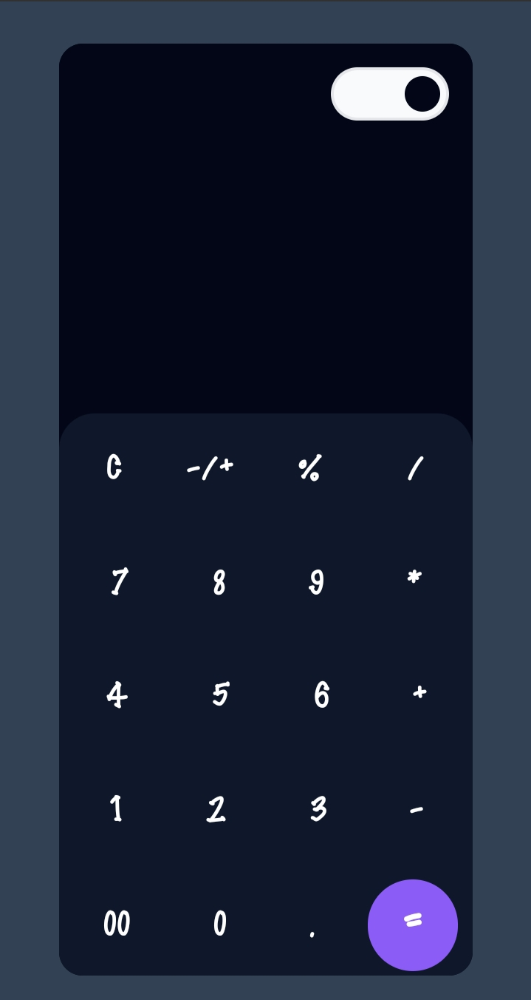
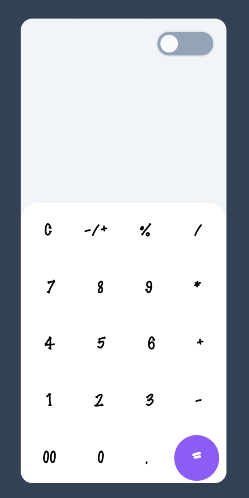

# Calculator (By Roshan)

This is a simple calculator web application built using HTML, CSS (with Tailwind CSS), and Vanilla JavaScript.

## Live Page

You can view the live version of the calculator app [here](https://neptech-roshan.github.io/Calculator_app/).

## Features

- Basic arithmetic operations: addition, subtraction, multiplication, division
- Percentage calculation
- Clear button to reset the calculator
- Toggle theme button to switch between light and dark mode

## Usage

1. Clone or download the repository.
2. Open the `index.html` file in your web browser.
3. Use the buttons to input numbers and perform calculations.
4. Click the "=" button to get the result.
5. Click the "C" button to clear the input.
6. Click the "%" button to calculate percentages.
7. Click the theme button to switch between light and dark mode.

## Screenshots

## Credits

- Built with ❤️ by [Roshan Patel]
- Fonts: [Montserrat](https://fonts.google.com/specimen/Montserrat)
- Icons: [Feather Icons](https://feathericons.com/)

## License

This project is licensed under the [MIT License](LICENSE.txt).
